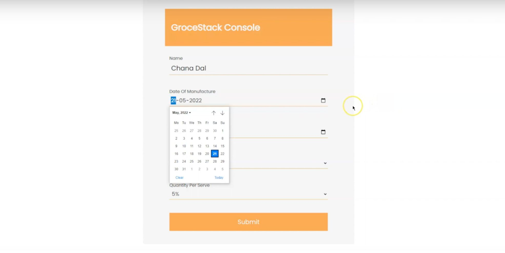

# Smart-Organiser-For-Dry-Grocery-SODG-

## Demonstration Video | https://www.youtube.com/watch?v=vZjnhM0rLtY

## Abstract

- Smart organizer for dry groceries is an IoT-based architectural solution to organize dry groceries in the kitchen based on the days until expiry. The proposed system has two components, the IoT device, and a web console.

- The lid of the grocery container has an RFID tag to uniquely identify the container and read by the device to fetch the required details. The proposed device displays information regarding the grocery, such as the name of the grocery, manufacturing date, days until expiry, and estimated quantity leftover in the container. The backend is a real-time database hosted in the cloud, which acts as a centralized repository for the IoT device and web console.

## Salient Features

The web console helps in fetching the required information about the grocery to the cloud-based backend. The salient features of the proposed system are as follows.

1. Data acquiring, processing, and transferring regarding the groceries are performed independently with the support of an embedded microcontroller and WiFi.
2. The IoT device utilizes NIST time servers to update the date time in the IoT device and synchronize the data seamlessly between the web console and the IoT device.
3. The IoT device is scalable to store data for the entire kitchen stack with the help of cloud storage.

## Documented Features

1. The dimensions of the device are 20cm x 12cm, making it portable and small size.
2. The exterior of the device is built of polycarbonate, making it durable.
3. To fetch details about the grocery, all it takes is a tap on the device, ensuring ease of
   use and simplicity.
4. The device has an embedded display for reading the information to ensure increased
   practicality.
5. Days remaining until expiry are calculated by retrieving the current date from NIST
   time servers, making the product accurate.
6. The device has a dedicated write key to ensure a smooth user experience.

## Proposed Modules

### Web Console

- Web console to input details of the grocery.

### IoT Device

- IoT Device to embed information to the lid of the container & fetching information
  about the grocery in the container.

### Hardware Implementation

| Component         |       Description       |
| :---------------- | :---------------------: |
| IoT Device        | NodeMCU, RFC Module,LCD |
| Device Setup      |        Complete         |
| Software Coding   |      Arduino (C++)      |
| Cloud Network     |     Firebase (BaaS)     |
| Bandwidth support |       2.4 & 5 Ghz       |
| Power usage       |          < 5W           |
